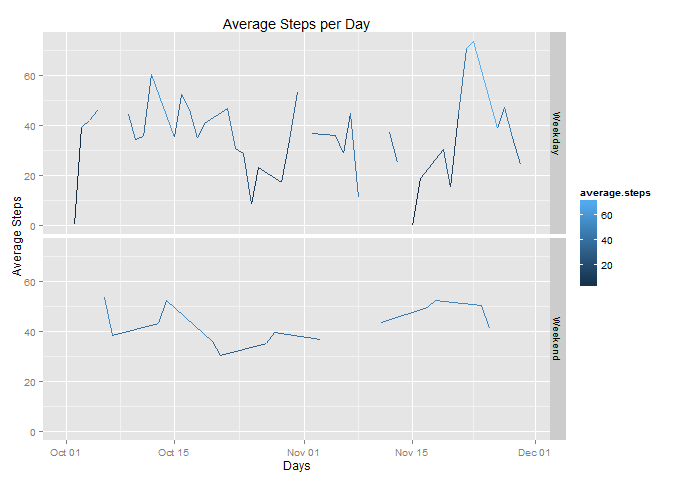

# Reproducible Research: Peer Assessment 1


## Loading and preprocessing the data

The analysis uses the lubridate, dplyr and ggplot2 packages and they are loaded first.
Then file file is read and the dates and steps data formatted appropriately.
Some required variables are set up and two data frames to deal with NAs


```r
      ## load any required packages
      library("lubridate")
      library("dplyr")
      library("ggplot2")
      ## load and process the data
      data.file <- "activity.csv"
      data <- tbl_df(read.table(data.file, header = TRUE, sep = ",", stringsAsFactors=FALSE))
      ## make sure the steps and date data are in the right format
      data$steps <- as.numeric(data$steps)
      data$date <- as.Date(data$date, format = "%Y-%m-%d") # ensure we have a date format
      #' create a month variable which is the month of the data in the main data file
      data$month <- month(data$date)
      #' summarise means by months and days to be used to replace missing values
      #' as any NA values for an entire day will be replaced by the month mean
      #' and any NA values where there is a day mean, will be replaced by the mean for the day
      means.by.months <- summarise( group_by(data, month), mnth.mean = mean(steps, na.rm=TRUE))
      means.by.days <- summarise(group_by(data, date), avg.steps = mean(steps, rna.rm=TRUE))
      #' add a month column to the means by days data frame to use as a lookup index when we 
      #' need to get the month mean because the day mean is NA
      means.by.days$month <- month(means.by.days$date) # so we can get month value if required
```


## What is mean total number of steps taken per day?


```r
      #' get the mean and median for display
      mean.of.all <- round(mean(data$steps, na.rm=TRUE), 2)
      median.of.all <- round(median(data$steps, na.rm=TRUE), 2)
      #'
      #'create a histogram of the steps by days
      steps.by.days <- summarise(group_by(data, date), day.steps = sum(steps, rna.rm=TRUE))
      png(filename = "hist-steps-per-day.png",width = 680, height = 480, units = "px",bg = "transparent")
      hist(steps.by.days$day.steps,  xlab = "Total of steps per day", 
            breaks = 10, col="red", main="Daily No of Steps")
      dev.off()
```


#### The mean total number of steps taken per day is 37.38
#### The median total number of steps taken per day is 0


## What is the average daily activity pattern?

```r
      ## get a list of means grouped by date
      x <- data %>% 
            group_by(date) %>% 
            summarise(average.steps = mean(steps)) 
      ## plot the average steps by day
      png(filename = "average-steps.png",width = 680, height = 480, units = "px",bg = "transparent")
      ggplot(x, aes(date, average.steps)) + 
            geom_line(aes(colour = average.steps, col="Avg Steps")) +
            labs(title="Average Steps per Day", x="Days", y="Average Steps")
      dev.off()
```


```r
      ## group the steps by interval and take the mean, then sort and take the top one.
      means.by.interval <- summarise( group_by(data, interval), int.mean = mean(steps, na.rm=TRUE))
      x <- arrange(means.by.interval, desc(int.mean))
```

#### The interval with the most steps on average is 835
#### The number of average steps for that interval was 206.17
#### 


## Imputing missing values
To replace any NAs, two data frames are created to help with the work.

1. means.by.days holds the mean for each day so that it can be used to replace an NA for that day 
2. means.by.month holds the means for each month, in case the day mean is NA. Then it is replaced by the month mean

In the data frame holding the activity data, for all NA data, the following steps are taken:

1. There are days that have NA means, so create a data frame to hold the means for the month
2. Then the any NA days are replaced by the Month mean from the previous data frame so that all days have a mean
3. If the steps data in the activity data set is NA, then the day mean is used to replace it.


```r
      ## first if there are means by day that are NA, we need to replace those first
      for(i in 1:length(means.by.days$avg.steps)) {
            if(is.na(means.by.days$avg.steps[i])) 
                  means.by.days$avg.steps[i] <- 
                        filter(means.by.months, month == means.by.days$month[i])[1,2]
      }
      ## so now replace the NAs in the activity data file with the day mean for that day    
      for(i in 1:length(data$steps)) {
            if(is.na(data$steps[i]))  # then we need to replace it
                  data$steps[i] <- as.numeric(filter(means.by.days, date == data$date[i])$avg.steps)
      }
```

### The new mean and histogram after imputing the NA values


```r
      new.mean.of.all <- round(mean(data$steps, na.rm=TRUE), 2)
      new.median.of.all <- round(median(data$steps, na.rm=TRUE), 2) 

      new.steps.by.days <- summarise(group_by(data, date), day.steps = sum(steps, rna.rm=TRUE))
      png(filename = "new-hist-steps-per-day.png",width = 680, height = 480, units = "px",bg = "transparent")
      hist(new.steps.by.days$day.steps,  xlab = "Total of steps per day", 
           breaks = 10, col="red", main="Daily No of Steps")
      dev.off()
```


#### The new mean total number of steps taken per day is 37.38
#### The new median total number of steps taken per day is 0


###### It is not surprising that the mean is still similar as the NAs were replaced by either the day or month mean and there are so many 0 values still, that the median has not changed either. However, the number of value around the mean has increased as you would expect, having done a mean replacement for NAs.


## Are there differences in activity patterns between weekdays and weekends?


```r
      #'    identify the days and then create a combined table with the day type
      x <- data %>% 
            group_by(date) %>% 
            summarise(average.steps = mean(steps)) 
      x$day <- wday(x$date, label=T)
      y <- data.frame(c("Mon","Tues","Wed","Thurs","Fri","Sat", "Sun"), 
                      c("Weekday","Weekday","Weekday","Weekday","Weekday", "Weekend","Weekend"))
      colnames(y) = c("day", "day.type")
      z <- left_join(x,y, by="day")
      #' now plot the data
      png(filename = "average-steps-daytype.png",width = 680, height = 480, 
          units = "px",bg = "transparent")
      ggplot(z, aes(date, average.steps)) + 
            facet_grid(day.type ~ .) +
            geom_line(aes(colour = average.steps, col="Avg Steps")) +
            labs(title="Average Steps per Day", x="Days", y="Average Steps")
      dev.off()
```


#### From the plot above, it is clear that the activity is far more consistend at weekends than it is during the week, which makes sense as that reflects the free time available for activity
